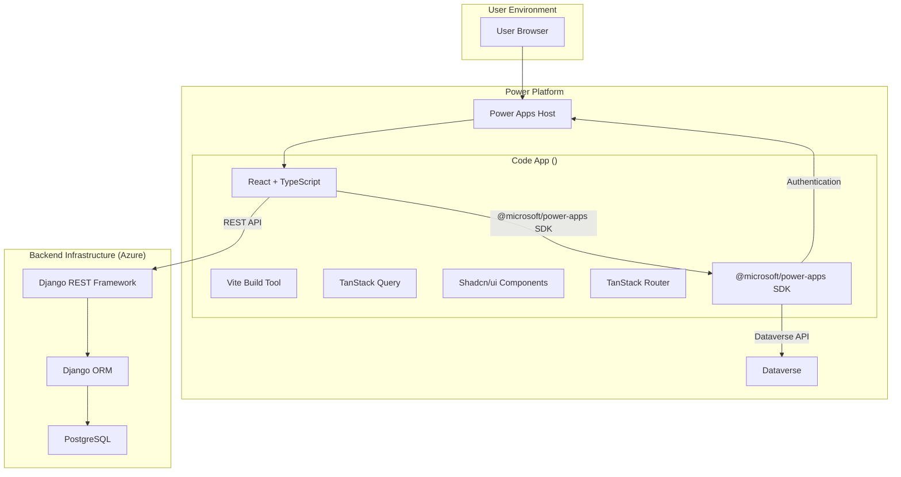

# システム全体概要

## 📋 目次
- [プロジェクト概要](#プロジェクト概要)
- [システムアーキテクチャビジョン](#システムアーキテクチャビジョン)
- [技術スタック](#技術スタック)
- [主要機能](#主要機能)
- [開発環境](#開発環境)

## プロジェクト概要

### プロジェクト名
**** - 統合プロジェクト・メンバー・タスク管理システム

### ビジョン
Power Apps Code Componentとして統合・デプロイされることを前提とした、モダンなフルスタックWebアプリケーション。プロジェクト管理、メンバー管理、クライアント管理、活動管理を一元化し、効率的なチームコラボレーションを実現する。

### ターゲットユーザー
- プロジェクトマネージャー
- チームメンバー
- クライアント管理者
- 経営層（ダッシュボード利用）

### 主な特徴
- 🔄 **Power Apps Code Apps統合**: Power Platform CLI (`pac`) を用いたシームレスな開発・デプロイと、Dataverse連携による既存エコシステムとの統合
- 🎨 **モダンUI/UX**: Shadcn/uiベースの洗練されたインターフェース
- 🔒 **セキュア**: Power Appsホストによる認証管理、CORS/CSRF対策、環境変数管理
- ⚡ **高速**: TanStack Queryによる効率的なデータキャッシング
- 📱 **レスポンシブ**: デスクトップ、タブレット、モバイル対応
- 🌓 **ダークモード**: ライト/ダークテーマ切り替え

## システムアーキテクチャビジョン

### アーキテクチャ原則

#### 1. **レイヤー分離**
```
┌─────────────────────────────────────┐
│    Presentation Layer (React)       │  ← ユーザーインターフェース
├─────────────────────────────────────┤
│    Application Layer (Services)     │  ← ビジネスロジック
├─────────────────────────────────────┤
│    Data Layer (API/Dataverse)       │  ← データアクセス
├─────────────────────────────────────┤
│    Persistence Layer (Django/DB)    │  ← データ永続化
└─────────────────────────────────────┘
```

#### 2. **疎結合・高凝集**
- コンポーネント間の依存を最小化
- 単一責任の原則に基づく設計
- インターフェースベースの開発

#### 3. **スケーラビリティ**
- 水平スケーリング可能な構成
- ステートレスなAPIサーバー
- キャッシング戦略の実装

#### 4. **保守性**
- 明確なディレクトリ構造
- 型安全性の確保
- コードの再利用性

### システム構成図



## 技術スタック

### フロントエンド ()

#### コアフレームワーク
| 技術 | バージョン | 用途 |
|------|-----------|------|
| React | 19.x | UIライブラリ |
| TypeScript | 5.x | 型安全な開発 |
| Vite | 7.x | ビルドツール |

#### 状態管理・データフェッチ
| 技術 | 用途 |
|------|------|
| TanStack Query (React Query) | サーバー状態管理、キャッシング |
| Zustand | クライアント状態管理 (dataverseStore) |

#### ルーティング
| 技術 | 用途 |
|------|------|
| TanStack Router | タイプセーフなルーティング |

#### UIコンポーネント
| 技術 | 用途 |
|------|------|
| Shadcn/ui | UIコンポーネントライブラリ |
| Radix UI | アクセシブルなプリミティブ |
| Tailwind CSS | ユーティリティファーストCSS |
| Lucide React | アイコンライブラリ |

#### フォーム・バリデーション
| 技術 | 用途 |
|------|------|
| React Hook Form | フォーム管理 |
| Zod | スキーマバリデーション |

#### 通知・UI拡張
| 技術 | 用途 |
|------|------|
| Sonner | トースト通知 |
| date-fns | 日付操作 |

### バックエンド ()

#### コアフレームワーク
| 技術 | バージョン | 用途 |
|------|-----------|------|
| Python | 3.x | プログラミング言語 |
| Django | 5.x | Webフレームワーク |
| Django REST Framework | 3.x | RESTful API |

#### データベース
| 技術 | 用途 |
|------|------|
| SQLite | 開発環境 |
| PostgreSQL | 本番環境（推奨） |

#### 認証・セキュリティ
| 技術 | 用途 |
|------|------|
| djangorestframework-simplejwt | JWT認証 |
| django-cors-headers | CORS設定 |

### Power Apps Code Apps 統合

| コンポーネント | 用途 |
|--------------|------|
| Power Platform CLI | `pac code`コマンドによる初期化、ローカル実行、デプロイ |
| `@microsoft/power-apps` SDK | Power Appsホストとの連携、認証、Dataverse APIアクセス |
| Dataverse | Power Platformネイティブのデータストレージ |
| Power Platform Solutions | アプリケーションのパッケージングと環境間移行 |

### 開発ツール

| ツール | 用途 |
|--------|------|
| ESLint | TypeScript/JavaScript Linting |
| Prettier | コードフォーマット |
| Black | Python コードフォーマット |
| Git | バージョン管理 |
| VS Code | 推奨IDE |

## 主要機能

### 1. 認証・認可
- Power AppsホストによるMicrosoft Entra IDベースの認証
- Django APIへのJWTベースの認証
- ロールベースアクセス制御（将来拡張）

### 2. ダッシュボード
- プロジェクト概要
- タスク進捗状況
- メンバーアクティビティ
- KPIビジュアライゼーション

### 3. プロジェクト管理
- プロジェクトCRUD操作
- プロジェクト詳細ビュー
- ステータス管理
- メンバーアサイン

### 4. メンバー管理
- メンバー一覧・検索
- プロフィール管理
- ロール・権限設定
- アクティビティ履歴

### 5. クライアント管理
- クライアント情報管理
- 連絡先管理
- プロジェクト紐付け

### 6. タスク管理
- タスク作成・割り当て
- 優先度・期限設定
- 進捗トラッキング
- コメント・添付ファイル（将来拡張）

### 7. アクティビティ管理
- 活動記録
- タイムトラッキング
- レポート生成

### 8. Dataverse連携
- テーブルスキーマ同期
- CRUD操作
- Power Fxを介したビジネスロジック実行
- Power Apps Model-driven Appとの統合

### 9. ツールポータル
- 各種ツールへのアクセス
- 統合ダッシュボード
- カスタマイズ可能なウィジェット

## 開発環境

### 推奨構成

#### ハードウェア
- CPU: 4コア以上
- メモリ: 8GB以上
- ストレージ: SSD推奨

#### ソフトウェア
- OS: Windows 10/11, macOS, Linux
- Node.js: 20.x以上
- Python: 3.9以上
- Git: 2.x以上
- **Power Platform CLI**: 最新版

### 環境セットアップ

#### Power Platform CLI
```powershell
# Power Platform CLIのインストール (dotnet toolを使用)
dotnet tool install --global Microsoft.PowerApps.CLI.Tool

# 認証プロファイルの作成
pac auth create --url https://your-org.crm.dynamics.com
```

#### フロントエンド
```powershell
# 依存関係のインストール
cd 
npm install

# Code Appプロジェクトとして初期化 (初回のみ)
pac code init --name  --template react

# 開発サーバー起動 (Vite + Power Apps Host)
npm run dev:pac
```

#### バックエンド
```powershell
cd 
python -m venv venv
.\venv\Scripts\Activate.ps1
pip install -r requirements.txt
python manage.py migrate
python manage.py runserver
```

### 環境変数

#### フロントエンド (.env)
```env
# Viteが使用するポート
PORT=5173

# Power Apps Hostがリッスンするポート
VITE_POWER_APPS_HOST_PORT=8181

# Django APIのベースURL
VITE_API_BASE_URL=http://localhost:8000/api

# Dataverse環境のURL
VITE_DATAVERSE_URL=https://your-org.crm.dynamics.com
```

#### バックエンド (.env)
```env
SECRET_KEY=your-secret-key
DEBUG=True
ALLOWED_HOSTS=localhost,127.0.0.1
DATABASE_URL=sqlite:///db.sqlite3
CORS_ALLOWED_ORIGINS=http://localhost:5173,http://localhost:8181
```

## ディレクトリ構造

### フロントエンド (/)
```
/
├── src/
│   ├── components/      # 再利用可能なUIコンポーネント
│   ├── pages/          # ページコンポーネント
│   ├── services/       # API通信サービス
│   ├── lib/            # ユーティリティ、Store
│   ├── hooks/          # カスタムフック
│   ├── types/          # TypeScript型定義
│   ├── providers/      # Contextプロバイダー
│   └── data/           # モックデータ、スキーマ
├── plugins/            # Viteプラグイン
└── public/             # 静的アセット
```

### バックエンド (/)
```
/
├── config/             # Django設定
├── projects/           # プロジェクトアプリ
├── members/            # メンバーアプリ
├── clients/            # クライアントアプリ
├── tasks/              # タスクアプリ
└── activities/         # アクティビティアプリ
```

## 次のステップ

詳細な実装ガイドラインについては、以下のドキュメントを参照してください:

1. [ARCHITECTURE.md](01_ARCHITECTURE.md) - 詳細アーキテクチャ
2. [FRONTEND_GUIDELINE.md](02_FRONTEND_GUIDELINE.md) - フロントエンド開発
3. [BACKEND_GUIDELINE.md](03_BACKEND_GUIDELINE.md) - バックエンド開発
4. [API_DESIGN.md](04_API_DESIGN.md) - API設計

---

**Version**: 1.1.0  
**Last Updated**: 2025年11月15日
