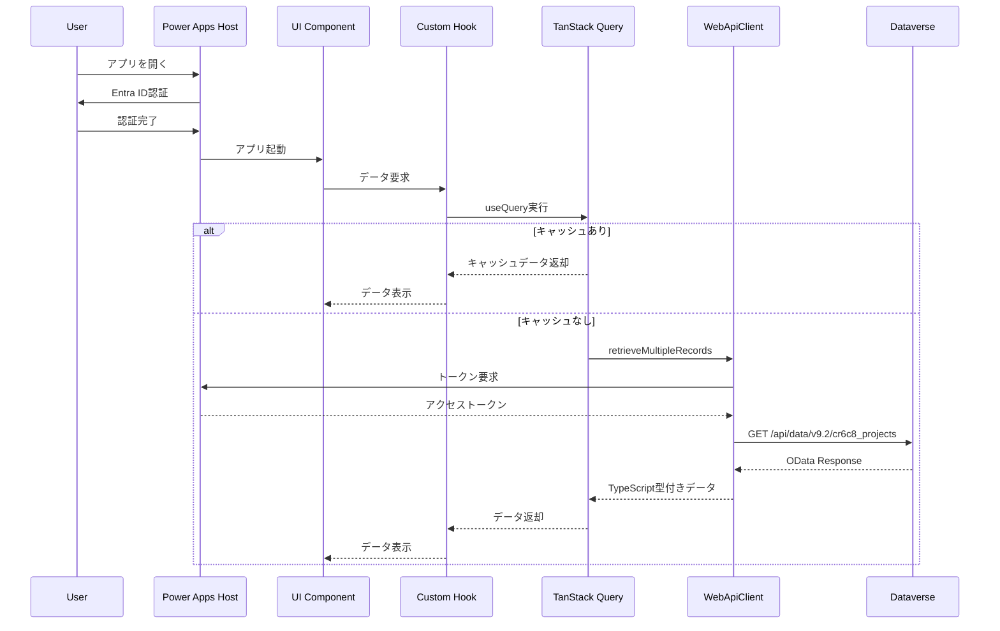
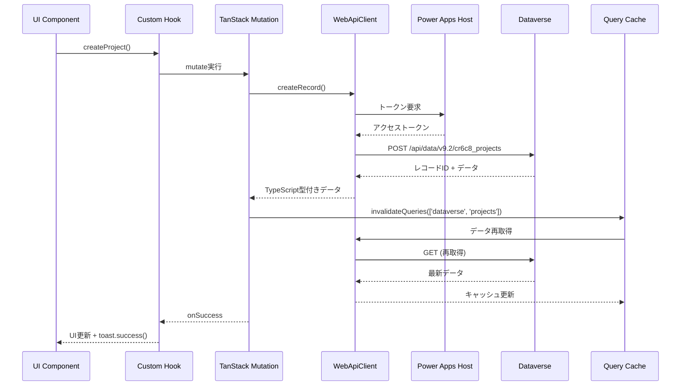
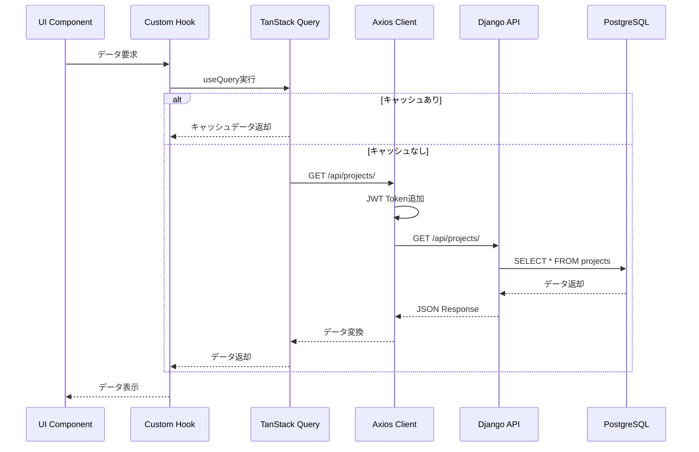
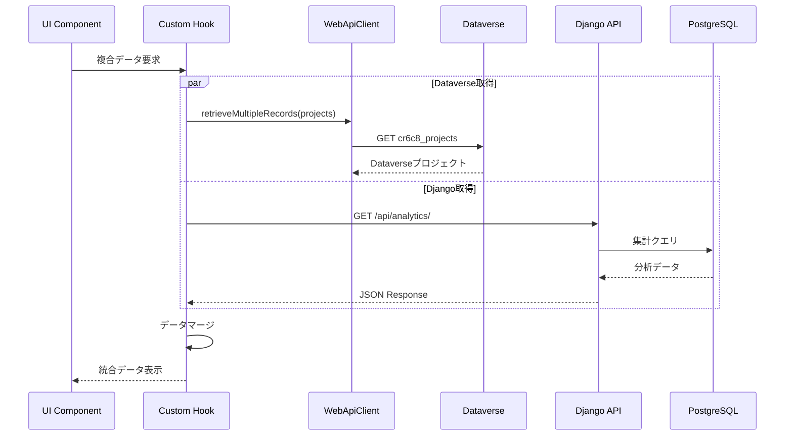
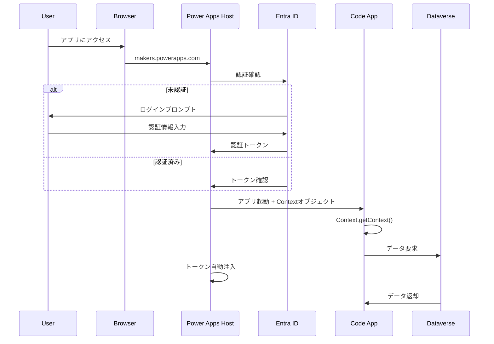

# アーキテクチャ詳細

## 📋 目次
- [アーキテクチャ概要](#アーキテクチャ概要)
- [レイヤーアーキテクチャ](#レイヤーアーキテクチャ)
- [データフロー](#データフロー)
- [コンポーネント設計](#コンポーネント設計)
- [状態管理戦略](#状態管理戦略)
- [エラーハンドリング](#エラーハンドリング)

## アーキテクチャ概要

### 設計原則

#### 1. **SOLID原則**

##### Single Responsibility Principle (単一責任の原則)
- 各モジュール・クラス・関数は単一の責任を持つ
- コンポーネントは1つの目的のみに焦点を当てる

```typescript
// ❌ 悪い例: 複数の責任を持つコンポーネント
function ProjectCard({ project }) {
  const [data, setData] = useState(null);
  
  useEffect(() => {
    // API呼び出し
    fetch(`/api/projects/${project.id}`)
      .then(res => res.json())
      .then(setData);
  }, []);
  
  // データ変換
  const formattedData = transformData(data);
  
  // レンダリング + ビジネスロジック
  return <div>{/* ... */}</div>;
}

// ✅ 良い例: 責任を分離
function ProjectCard({ project }) {
  const { data } = useProject(project.id); // データ取得
  const formattedData = useFormattedProject(data); // データ変換
  return <ProjectCardView data={formattedData} />; // プレゼンテーション
}
```

##### Open/Closed Principle (開放閉鎖の原則)
- 拡張に対して開いている
- 修正に対して閉じている

```typescript
// ✅ 拡張可能な設計
interface DataverseService {
  create<T>(table: string, data: T): Promise<T>;
  read<T>(table: string, id: string): Promise<T>;
  update<T>(table: string, id: string, data: Partial<T>): Promise<T>;
  delete(table: string, id: string): Promise<void>;
}

// 新しい機能を追加する際、既存コードを変更しない
class CachedDataverseService implements DataverseService {
  constructor(private baseService: DataverseService) {}
  
  async read<T>(table: string, id: string): Promise<T> {
    const cached = this.cache.get(`${table}:${id}`);
    if (cached) return cached;
    
    const data = await this.baseService.read<T>(table, id);
    this.cache.set(`${table}:${id}`, data);
    return data;
  }
}
```

##### Liskov Substitution Principle (リスコフの置換原則)
- 派生型は基本型と置換可能であるべき

##### Interface Segregation Principle (インターフェース分離の原則)
- クライアントに不要なインターフェースへの依存を強制しない

##### Dependency Inversion Principle (依存性逆転の原則)
- 上位モジュールは下位モジュールに依存しない
- 両方とも抽象に依存する

#### 2. **DRY (Don't Repeat Yourself)**
- コードの重複を避ける
- 共通ロジックを抽出し再利用する

#### 3. **KISS (Keep It Simple, Stupid)**
- シンプルな解決策を優先
- 過度な抽象化を避ける

#### 4. **YAGNI (You Aren't Gonna Need It)**
- 現在必要な機能のみを実装
- 将来の拡張性は考慮するが、実装は必要になってから

## レイヤーアーキテクチャ

### 全体構成 (Power Apps Code Apps)

```
┌───────────────────────────────────────────────────────────────────┐
│                    Power Apps Host Layer                          │
│  ┌────────────────────────────────────────────────────────────┐  │
│  │  • Microsoft Entra ID Authentication                       │  │
│  │  • Context Management (User, Organization)                 │  │
│  │  • Navigation & Routing Support                            │  │
│  │  • Environment Variables                                   │  │
│  └────────────────────────────────────────────────────────────┘  │
└───────────────────────────────┬───────────────────────────────────┘
                                │
┌───────────────────────────────▼───────────────────────────────────┐
│                    Presentation Layer (React 19)                  │
│  ┌──────────────┐  ┌──────────────┐  ┌──────────────┐           │
│  │   Pages      │  │  Components  │  │   Layouts    │           │
│  │  (Routing)   │  │  (UI Parts)  │  │  (Templates) │           │
│  └──────────────┘  └──────────────┘  └──────────────┘           │
│                                                                   │
│  React 19 Features:                                              │
│  • React Compiler (自動最適化)                                    │
│  • use() Hook (Suspense統合)                                     │
│  • Server Components (将来対応)                                   │
└───────────────────────────────┬───────────────────────────────────┘
                                │
┌───────────────────────────────▼───────────────────────────────────┐
│                    Application Layer                              │
│  ┌──────────────┐  ┌──────────────┐  ┌──────────────┐           │
│  │   Hooks      │  │   Services   │  │  Providers   │           │
│  │  (Logic)     │  │  (Business)  │  │  (Context)   │           │
│  └──────────────┘  └──────────────┘  └──────────────┘           │
│                                                                   │
│  • TanStack Query (Server State)                                 │
│  • Zustand (Client State)                                        │
│  • React Hook Form (Form State)                                  │
└───────────────────────────────┬───────────────────────────────────┘
                                │
        ┌───────────────────────┴───────────────────────┐
        │                                               │
┌───────▼─────────────────────┐      ┌─────────────────▼──────────┐
│    Data Layer (Dataverse)   │      │  Data Layer (External API) │
│  ┌─────────────────────┐    │      │  ┌─────────────────────┐   │
│  │  WebApiClient       │    │      │  │  Axios Client       │   │
│  │  (@microsoft/       │    │      │  │  (Django REST)      │   │
│  │   power-apps)       │    │      │  │                     │   │
│  └─────────────────────┘    │      │  └─────────────────────┘   │
│                              │      │                            │
│  • Auto-generated Types     │      │  • Manual Types            │
│  • OData Query              │      │  • REST API                │
│  • Built-in Auth            │      │  • JWT Auth                │
└───────┬──────────────────────┘      └─────────────┬──────────────┘
        │                                           │
        │                             ┌─────────────▼──────────────┐
        │                             │   Backend API Layer        │
        │                             │  ┌──────────────────────┐  │
        │                             │  │  Django REST         │  │
        │                             │  │  Framework           │  │
        │                             │  └──────────────────────┘  │
        │                             │                            │
        │                             │  • ViewSets              │
        │                             │  • Serializers           │
        │                             │  • Permissions           │
        │                             └─────────────┬──────────────┘
        │                                           │
┌───────▼───────────────────────────────────────────▼──────────────┐
│                      Domain & Persistence Layer                   │
│  ┌──────────────────┐         ┌──────────────────────────────┐  │
│  │   Dataverse      │         │      PostgreSQL/SQLite       │  │
│  │   Tables         │         │      (Django ORM)            │  │
│  │                  │         │                              │  │
│  │  • cr6c8_projects│         │  • projects                  │  │
│  │  • cr6c8_clients │         │  • clients                   │  │
│  │  • cr6c8_members │         │  • members                   │  │
│  └──────────────────┘         └──────────────────────────────┘  │
└───────────────────────────────────────────────────────────────────┘
```

### レイヤー詳細

#### 1. Presentation Layer (プレゼンテーション層)

**責務**: ユーザーインターフェースの表示とユーザーインタラクションの処理

**構成要素**:
- **Pages**: ルートに対応するページコンポーネント
- **Components**: 再利用可能なUIコンポーネント
- **Layouts**: ページレイアウトテンプレート

**実装規則**:
```typescript
// ページコンポーネント (pages/)
// - ルーティングと対応
// - データ取得のトリガー
// - レイアウトの適用
export function ProjectsPage() {
  const { data: projects, isLoading } = useProjects();
  
  if (isLoading) return <LoadingSpinner />;
  
  return (
    <div>
      <ProjectsHeader />
      <ProjectsList projects={projects} />
    </div>
  );
}

// UIコンポーネント (components/)
// - プレゼンテーションのみ
// - propsでデータを受け取る
// - ビジネスロジックを含まない
interface ProjectCardProps {
  project: Project;
  onEdit?: (project: Project) => void;
  onDelete?: (id: string) => void;
}

export function ProjectCard({ project, onEdit, onDelete }: ProjectCardProps) {
  return (
    <Card>
      <CardHeader>{project.name}</CardHeader>
      <CardContent>{project.description}</CardContent>
    </Card>
  );
}
```

#### 2. Application Layer (アプリケーション層)

**責務**: ビジネスロジックの調整とアプリケーション状態の管理

**構成要素**:
- **Hooks**: カスタムフック（データ取得、状態管理）
- **Services**: ビジネスロジックとAPI通信
- **Providers**: Contextプロバイダー

**実装規則**:
```typescript
// カスタムフック (hooks/)
// - TanStack Queryを使用したデータ取得
// - 状態管理ロジックのカプセル化
export function useProjects() {
  return useQuery({
    queryKey: ['projects'],
    queryFn: () => projectService.getAll(),
    staleTime: 5 * 60 * 1000, // 5分
  });
}

export function useCreateProject() {
  const queryClient = useQueryClient();
  
  return useMutation({
    mutationFn: (data: CreateProjectDto) => projectService.create(data),
    onSuccess: () => {
      queryClient.invalidateQueries({ queryKey: ['projects'] });
      toast.success('プロジェクトを作成しました');
    },
    onError: (error) => {
      toast.error('作成に失敗しました');
      console.error(error);
    },
  });
}

// サービス (services/)
// - API通信の抽象化
// - エラーハンドリング
// - データ変換
export const projectService = {
  async getAll(): Promise<Project[]> {
    const response = await apiClient.get<Project[]>('/projects/');
    return response.data;
  },
  
  async create(data: CreateProjectDto): Promise<Project> {
    const response = await apiClient.post<Project>('/projects/', data);
    return response.data;
  },
  
  async update(id: string, data: UpdateProjectDto): Promise<Project> {
    const response = await apiClient.patch<Project>(`/projects/${id}/`, data);
    return response.data;
  },
};
```

#### 3. Data Layer (データ層)

**責務**: データの取得、キャッシング、永続化

**構成要素**:
- **API Client**: HTTP通信クライアント
- **Dataverse**: Power Apps統合
- **Store**: クライアント状態管理

**実装規則**:
```typescript
// Dataverse WebApiClient (Power Apps Code Apps標準)
import { WebApiClient } from '@microsoft/power-apps';

export const dataverseClient = new WebApiClient();

// Dataverseサービス
export const dataverseService = {
  async getProjects() {
    const response = await dataverseClient.retrieveMultipleRecords('cr6c8_projects', {
      select: ['cr6c8_projectid', 'cr6c8_name', 'cr6c8_status'],
      orderBy: ['cr6c8_name asc'],
    });
    return response.entities;
  },
  
  async createProject(data: Partial<Project>) {
    return await dataverseClient.createRecord('cr6c8_projects', data);
  },
};

// Django API Client (外部APIアクセス用)
import axios from 'axios';

export const apiClient = axios.create({
  baseURL: import.meta.env.VITE_API_BASE_URL || 'http://localhost:8000/api',
  timeout: 10000,
  headers: {
    'Content-Type': 'application/json',
  },
});

// リクエストインターセプター: 認証トークン追加
apiClient.interceptors.request.use((config) => {
  const token = localStorage.getItem('access_token');
  if (token) {
    config.headers.Authorization = `Bearer ${token}`;
  }
  return config;
});

// レスポンスインターセプター: エラーハンドリング
apiClient.interceptors.response.use(
  (response) => response,
  async (error) => {
    if (error.response?.status === 401) {
      // トークンリフレッシュロジック
      const newToken = await refreshToken();
      if (newToken) {
        error.config.headers.Authorization = `Bearer ${newToken}`;
        return apiClient.request(error.config);
      }
    }
    return Promise.reject(error);
  }
);

// Zustand Store (クライアント状態管理)
import { create } from 'zustand';
import { persist } from 'zustand/middleware';

// UI状態管理
interface UIStore {
  sidebarOpen: boolean;
  theme: 'light' | 'dark' | 'system';
  currentView: 'dashboard' | 'projects' | 'clients';
  toggleSidebar: () => void;
  setTheme: (theme: 'light' | 'dark' | 'system') => void;
  setView: (view: string) => void;
}

export const useUIStore = create<UIStore>()(
  persist(
    (set) => ({
      sidebarOpen: true,
      theme: 'system',
      currentView: 'dashboard',
      toggleSidebar: () => set((state) => ({ sidebarOpen: !state.sidebarOpen })),
      setTheme: (theme) => set({ theme }),
      setView: (view) => set({ currentView: view as any }),
    }),
    {
      name: 'ui-storage', // localStorage key
    }
  )
);

// React 19の新機能: use() Hook (非同期データ取得)
import { use } from 'react';

function ProjectDetail({ projectId }: { projectId: string }) {
  // Suspenseと統合されたデータ取得
  const project = use(dataverseClient.retrieveRecord('cr6c8_projects', projectId));
  
  return <div>{project.cr6c8_name}</div>;
}

// Suspenseで囲む
function ProjectDetailPage({ projectId }: { projectId: string }) {
  return (
    <Suspense fallback={<LoadingSpinner />}>
      <ProjectDetail projectId={projectId} />
    </Suspense>
  );
}
```

#### 4. Backend API Layer (バックエンドAPI層)

**責務**: RESTful APIエンドポイントの提供

**構成要素**:
- **Views**: APIビュー
- **Serializers**: データシリアライゼーション
- **Permissions**: 認証・認可

**実装規則**:
```python
# Views (views.py)
from rest_framework import viewsets
from rest_framework.permissions import IsAuthenticated
from .models import Project
from .serializers import ProjectSerializer

class ProjectViewSet(viewsets.ModelViewSet):
    """
    プロジェクトのCRUD操作を提供するViewSet
    """
    queryset = Project.objects.all()
    serializer_class = ProjectSerializer
    permission_classes = [IsAuthenticated]
    
    def get_queryset(self):
        """ユーザーに関連するプロジェクトのみ取得"""
        user = self.request.user
        return Project.objects.filter(members=user)

# Serializers (serializers.py)
from rest_framework import serializers
from .models import Project

class ProjectSerializer(serializers.ModelSerializer):
    member_count = serializers.SerializerMethodField()
    
    class Meta:
        model = Project
        fields = ['id', 'name', 'description', 'start_date', 
                  'end_date', 'status', 'member_count']
        read_only_fields = ['id']
    
    def get_member_count(self, obj):
        return obj.members.count()
    
    def validate_end_date(self, value):
        """終了日が開始日より後であることを検証"""
        if value and self.initial_data.get('start_date'):
            if value < self.initial_data['start_date']:
                raise serializers.ValidationError(
                    "終了日は開始日より後である必要があります"
                )
        return value
```

#### 5. Domain Layer (ドメイン層)

**責務**: ビジネスルールとドメインロジックの実装

**構成要素**:
- **Models**: データモデル
- **Business Logic**: ビジネスロジック
- **Validators**: バリデーション

**実装規則**:
```python
# Models (models.py)
from django.db import models
from django.core.validators import MinValueValidator

class Project(models.Model):
    """プロジェクトモデル"""
    
    STATUS_CHOICES = [
        ('planning', '計画中'),
        ('active', '進行中'),
        ('completed', '完了'),
        ('on_hold', '保留'),
    ]
    
    name = models.CharField(max_length=200, verbose_name='プロジェクト名')
    description = models.TextField(blank=True, verbose_name='説明')
    start_date = models.DateField(verbose_name='開始日')
    end_date = models.DateField(null=True, blank=True, verbose_name='終了日')
    status = models.CharField(
        max_length=20,
        choices=STATUS_CHOICES,
        default='planning',
        verbose_name='ステータス'
    )
    budget = models.DecimalField(
        max_digits=10,
        decimal_places=2,
        validators=[MinValueValidator(0)],
        null=True,
        blank=True,
        verbose_name='予算'
    )
    
    created_at = models.DateTimeField(auto_now_add=True)
    updated_at = models.DateTimeField(auto_now=True)
    
    class Meta:
        db_table = 'projects'
        ordering = ['-created_at']
        indexes = [
            models.Index(fields=['status', '-created_at']),
        ]
    
    def __str__(self):
        return self.name
    
    @property
    def is_overdue(self):
        """プロジェクトが期限切れかどうか"""
        if self.end_date and self.status != 'completed':
            from django.utils import timezone
            return timezone.now().date() > self.end_date
        return False
    
    def complete(self):
        """プロジェクトを完了状態にする"""
        self.status = 'completed'
        self.save()
```

## データフロー

### Dataverse直接連携フロー (推奨パターン)



### Dataverse書き込みフロー



### 外部API連携フロー (Django Backend)



### ハイブリッド連携フロー (Dataverse + Django)



## コンポーネント設計

### コンポーネント分類

#### 1. **Page Components** (ページコンポーネント)
- ルートに対応
- データ取得を開始
- レイアウトを適用

```typescript
// src/pages/projects.tsx
export function ProjectsPage() {
  const { data: projects, isLoading, error } = useProjects();
  const createProject = useCreateProject();
  
  return (
    <div className="container mx-auto py-6">
      <ProjectsHeader onCreateClick={() => setShowDialog(true)} />
      
      {isLoading && <LoadingSpinner />}
      {error && <ErrorMessage error={error} />}
      {projects && <ProjectsList projects={projects} />}
      
      <CreateProjectDialog
        open={showDialog}
        onClose={() => setShowDialog(false)}
        onSubmit={createProject.mutate}
      />
    </div>
  );
}
```

#### 2. **Container Components** (コンテナコンポーネント)
- ビジネスロジックを持つ
- 子コンポーネントにデータを渡す

```typescript
// src/components/ProjectsList.tsx
interface ProjectsListProps {
  projects: Project[];
}

export function ProjectsList({ projects }: ProjectsListProps) {
  const [filter, setFilter] = useState('all');
  const deleteProject = useDeleteProject();
  
  const filteredProjects = useMemo(() => {
    return projects.filter(p => filter === 'all' || p.status === filter);
  }, [projects, filter]);
  
  return (
    <div>
      <ProjectsFilter value={filter} onChange={setFilter} />
      <div className="grid gap-4">
        {filteredProjects.map(project => (
          <ProjectCard
            key={project.id}
            project={project}
            onDelete={() => deleteProject.mutate(project.id)}
          />
        ))}
      </div>
    </div>
  );
}
```

#### 3. **Presentational Components** (プレゼンテーショナルコンポーネント)
- UIのみに焦点
- propsでデータを受け取る
- 状態を持たない（または最小限）

```typescript
// src/components/ProjectCard.tsx
interface ProjectCardProps {
  project: Project;
  onEdit?: (project: Project) => void;
  onDelete?: () => void;
}

export function ProjectCard({ project, onEdit, onDelete }: ProjectCardProps) {
  return (
    <Card>
      <CardHeader>
        <CardTitle>{project.name}</CardTitle>
        <CardDescription>{project.description}</CardDescription>
      </CardHeader>
      <CardContent>
        <div className="flex gap-2">
          <Badge>{project.status}</Badge>
          <span className="text-sm text-muted-foreground">
            {format(new Date(project.start_date), 'yyyy/MM/dd')}
          </span>
        </div>
      </CardContent>
      <CardFooter className="justify-end gap-2">
        {onEdit && (
          <Button variant="outline" onClick={() => onEdit(project)}>
            編集
          </Button>
        )}
        {onDelete && (
          <Button variant="destructive" onClick={onDelete}>
            削除
          </Button>
        )}
      </CardFooter>
    </Card>
  );
}
```

#### 4. **UI Components** (UIコンポーネント)
- Shadcn/uiベース
- 汎用的で再利用可能
- プロジェクト固有のロジックを持たない

```typescript
// src/components/ui/button.tsx
export interface ButtonProps extends React.ButtonHTMLAttributes<HTMLButtonElement> {
  variant?: 'default' | 'destructive' | 'outline' | 'ghost';
  size?: 'default' | 'sm' | 'lg' | 'icon';
}

export const Button = React.forwardRef<HTMLButtonElement, ButtonProps>(
  ({ className, variant = 'default', size = 'default', ...props }, ref) => {
    return (
      <button
        className={cn(buttonVariants({ variant, size, className }))}
        ref={ref}
        {...props}
      />
    );
  }
);
```

### コンポーネント構成パターン

#### Compound Components Pattern
```typescript
// 複合コンポーネント: 柔軟性と再利用性を提供
export function ProjectCard({ project }: { project: Project }) {
  return (
    <Card>
      <Card.Header>
        <Card.Title>{project.name}</Card.Title>
      </Card.Header>
      <Card.Content>
        {project.description}
      </Card.Content>
      <Card.Footer>
        <Button>詳細</Button>
      </Card.Footer>
    </Card>
  );
}
```

#### Render Props Pattern
```typescript
// データ取得ロジックを共有
function ProjectData({ projectId, children }: {
  projectId: string;
  children: (data: { project: Project; isLoading: boolean }) => React.ReactNode;
}) {
  const { data: project, isLoading } = useProject(projectId);
  return <>{children({ project, isLoading })}</>;
}

// 使用例
<ProjectData projectId="123">
  {({ project, isLoading }) => (
    isLoading ? <Spinner /> : <ProjectView project={project} />
  )}
</ProjectData>
```

## 状態管理戦略

### 状態の分類

#### 1. **Server State** (サーバー状態)
- バックエンドから取得したデータ
- TanStack Queryで管理
- キャッシング、再取得、同期

```typescript
// サーバー状態の管理
const { data, isLoading, error, refetch } = useQuery({
  queryKey: ['projects', { status: 'active' }],
  queryFn: () => projectService.getAll({ status: 'active' }),
  staleTime: 5 * 60 * 1000, // 5分間は新鮮
  cacheTime: 10 * 60 * 1000, // 10分間キャッシュ保持
});
```

#### 2. **Client State** (クライアント状態)
- UIの状態（モーダルの開閉、フォーム入力など）
- React StateまたはZustandで管理

```typescript
// Zustand: グローバルなクライアント状態
interface UIStore {
  sidebarOpen: boolean;
  theme: 'light' | 'dark';
  toggleSidebar: () => void;
  setTheme: (theme: 'light' | 'dark') => void;
}

export const useUIStore = create<UIStore>((set) => ({
  sidebarOpen: true,
  theme: 'light',
  toggleSidebar: () => set((state) => ({ sidebarOpen: !state.sidebarOpen })),
  setTheme: (theme) => set({ theme }),
}));

// React State: ローカルなUI状態
function ProjectForm() {
  const [isOpen, setIsOpen] = useState(false);
  const [formData, setFormData] = useState<FormData>(initialData);
  
  // ...
}
```

#### 3. **URL State** (URL状態)
- フィルター、ページネーション、検索クエリ
- TanStack Routerで管理

```typescript
// URL状態: 共有可能、ブックマーク可能
const projectsRoute = createRoute({
  path: '/projects',
  validateSearch: (search: Record<string, unknown>) => ({
    page: Number(search.page) || 1,
    status: (search.status as string) || 'all',
    search: (search.search as string) || '',
  }),
  component: ProjectsPage,
});

function ProjectsPage() {
  const { page, status, search } = useSearch({ from: projectsRoute.id });
  // URLパラメータに基づいてデータ取得
}
```

#### 4. **Form State** (フォーム状態)
- React Hook Formで管理
- バリデーション、エラーハンドリング

```typescript
// フォーム状態管理
const form = useForm<ProjectFormData>({
  resolver: zodResolver(projectSchema),
  defaultValues: {
    name: '',
    description: '',
    start_date: new Date(),
  },
});

function onSubmit(data: ProjectFormData) {
  createProject.mutate(data);
}
```

## エラーハンドリング

### エラー分類と対応

#### 1. **ネットワークエラー**
```typescript
// APIクライアントでのエラーハンドリング
apiClient.interceptors.response.use(
  (response) => response,
  (error) => {
    if (!error.response) {
      // ネットワークエラー
      toast.error('ネットワークエラーが発生しました');
    }
    return Promise.reject(error);
  }
);
```

#### 2. **認証エラー (401)**
```typescript
// トークンリフレッシュ
if (error.response?.status === 401) {
  const newToken = await refreshToken();
  error.config.headers.Authorization = `Bearer ${newToken}`;
  return apiClient.request(error.config);
}
```

#### 3. **認可エラー (403)**
```typescript
if (error.response?.status === 403) {
  toast.error('この操作を実行する権限がありません');
  navigate('/');
}
```

#### 4. **バリデーションエラー (400)**
```typescript
if (error.response?.status === 400) {
  const errors = error.response.data;
  Object.keys(errors).forEach(field => {
    form.setError(field, { message: errors[field][0] });
  });
}
```

#### 5. **サーバーエラー (500)**
```typescript
if (error.response?.status >= 500) {
  toast.error('サーバーエラーが発生しました。しばらくしてから再度お試しください');
  // エラーログ送信
  logError(error);
}
```

### Error Boundary

```typescript
// グローバルエラーハンドリング (React 18/19)
import { Component, ErrorInfo, ReactNode } from 'react';

interface Props {
  children: ReactNode;
  fallback?: ReactNode;
}

interface State {
  hasError: boolean;
  error?: Error;
}

export class ErrorBoundary extends Component<Props, State> {
  constructor(props: Props) {
    super(props);
    this.state = { hasError: false };
  }

  static getDerivedStateFromError(error: Error): State {
    return { hasError: true, error };
  }

  componentDidCatch(error: Error, errorInfo: ErrorInfo) {
    console.error('Error caught by boundary:', error, errorInfo);
    
    // Application Insights等にログ送信
    if (import.meta.env.PROD) {
      logError(error, errorInfo);
    }
  }
  
  render() {
    if (this.state.hasError) {
      return this.props.fallback || (
        <ErrorFallback 
          error={this.state.error} 
          onReset={() => this.setState({ hasError: false, error: undefined })} 
        />
      );
    }
    return this.props.children;
  }
}
```

## セキュリティアーキテクチャ

### 認証フロー (Power Apps Code Apps)



### 多層防御アーキテクチャ

```
┌──────────────────────────────────────────────────────────┐
│  Layer 1: Network Security                               │
│  • HTTPS Only                                            │
│  • CORS Policy (Power Platform Domains)                 │
│  • CSP Headers                                           │
└──────────────────────┬───────────────────────────────────┘
                       │
┌──────────────────────▼───────────────────────────────────┐
│  Layer 2: Authentication & Authorization                 │
│  • Microsoft Entra ID (Power Apps Host)                  │
│  • JWT Token (Django API)                                │
│  • Role-Based Access Control (RBAC)                      │
└──────────────────────┬───────────────────────────────────┘
                       │
┌──────────────────────▼───────────────────────────────────┐
│  Layer 3: Application Security                           │
│  • Input Validation (Zod Schema)                         │
│  • XSS Protection (DOMPurify)                            │
│  • CSRF Token (Django)                                   │
└──────────────────────┬───────────────────────────────────┘
                       │
┌──────────────────────▼───────────────────────────────────┐
│  Layer 4: Data Security                                  │
│  • Dataverse Security Roles                              │
│  • Field-Level Security                                  │
│  • Audit Logging                                         │
│  • Database Encryption (TDE)                             │
└──────────────────────────────────────────────────────────┘
```

### セキュリティベストプラクティス

#### 1. 環境変数の安全な管理
```typescript
// ❌ 悪い例: コードにハードコード
const API_KEY = 'sk_live_abc123def456';

// ✅ 良い例: Power Platform環境変数
import { Environment } from '@microsoft/power-apps';

async function getApiKey(): Promise<string> {
  const envVars = await Environment.getEnvironmentVariables();
  return envVars['BackendApiKey'];
}
```

#### 2. XSS対策
```typescript
import DOMPurify from 'dompurify';

// ユーザー入力のサニタイズ
function SafeHTML({ html }: { html: string }) {
  const sanitized = DOMPurify.sanitize(html, {
    ALLOWED_TAGS: ['b', 'i', 'em', 'strong', 'a'],
    ALLOWED_ATTR: ['href'],
  });
  
  return <div dangerouslySetInnerHTML={{ __html: sanitized }} />;
}
```

#### 3. CSRF対策 (Django)
```python
# settings.py
CSRF_TRUSTED_ORIGINS = [
    'https://make.powerapps.com',
    'https://*.crm.dynamics.com',
]

# views.py
from rest_framework.decorators import api_view
from django.views.decorators.csrf import csrf_exempt

@csrf_exempt  # Power Appsからのリクエストは除外
@api_view(['POST'])
def create_project(request):
    # Power Apps認証を検証
    if not verify_power_apps_token(request):
        return Response(status=403)
    # ...
```

## パフォーマンスアーキテクチャ

### コード分割戦略

```typescript
// ルートベースのコード分割
import { lazy } from 'react';

const ProjectsPage = lazy(() => import('./pages/projects'));
const ClientsPage = lazy(() => import('./pages/clients'));
const AnalyticsPage = lazy(() => import('./pages/analytics'));

// 条件付きインポート
const AdminPanel = lazy(() => 
  import('./pages/admin').then(module => ({
    default: module.AdminPanel
  }))
);
```

### 最適化パターン

```typescript
// React 19 Compiler: 自動メモ化
// memo(), useMemo(), useCallback()は不要に

// React 18以前
const MemoizedComponent = memo(({ data }) => {
  return <div>{data.name}</div>;
});

// React 19 (Compilerが自動最適化)
function OptimizedComponent({ data }) {
  return <div>{data.name}</div>;
}
```

### キャッシュ戦略

```typescript
// TanStack Query: 階層的キャッシング
const queryClient = new QueryClient({
  defaultOptions: {
    queries: {
      // グローバルデフォルト
      staleTime: 60 * 1000, // 1分
      gcTime: 5 * 60 * 1000, // 5分 (旧cacheTime)
      retry: 3,
      retryDelay: (attemptIndex) => Math.min(1000 * 2 ** attemptIndex, 30000),
    },
  },
});

// マスターデータ: 長期キャッシュ
useQuery({
  queryKey: ['masterdata', 'clients'],
  queryFn: fetchClients,
  staleTime: Infinity, // 永続キャッシュ
  gcTime: Infinity,
});

// トランザクションデータ: 短期キャッシュ
useQuery({
  queryKey: ['transactions', date],
  queryFn: () => fetchTransactions(date),
  staleTime: 30 * 1000, // 30秒
});
```

---

**Version**: 2.0.0  
**Last Updated**: 2025年11月14日  
**対応技術**: React 19, Power Apps Code Apps, Django 5.x
