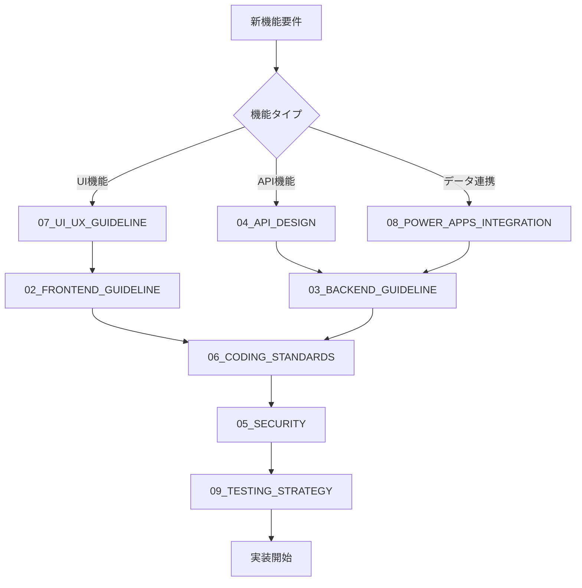

# MusubiSuite 開発ガイドライン

## 📚 ガイドライン索引

本ガイドラインは、MusubiSuiteプロジェクトにおける一貫性のある高品質なコード開発を支援するために作成されました。AI自動コード生成時にこれらのガイドラインを参照することで、実装方針やセキュリティ対策のばらつきを防ぎます。

### ガイドライン構成

| No | ファイル名 | 内容 | 対象者 |
|---|---|---|---|
| 00 | [OVERVIEW.md](00_OVERVIEW.md) | システム全体概要とアーキテクチャビジョン | 全員 |
| 01 | [ARCHITECTURE.md](01_ARCHITECTURE.md) | 詳細アーキテクチャとレイヤー構成 | アーキテクト、リード開発者 |
| 02 | [FRONTEND_GUIDELINE.md](02_FRONTEND_GUIDELINE.md) | React/TypeScript開発規約 | フロントエンド開発者 |
| 03 | [BACKEND_GUIDELINE.md](03_BACKEND_GUIDELINE.md) | Django REST Framework開発規約 | バックエンド開発者 |
| 04 | [API_DESIGN.md](04_API_DESIGN.md) | API設計原則とデータフロー | フルスタック開発者 |
| 05 | [SECURITY.md](05_SECURITY.md) | セキュリティ対策とベストプラクティス | 全開発者 |
| 06 | [CODING_STANDARDS.md](06_CODING_STANDARDS.md) | コーディング規約と命名規則 | 全開発者 |
| 07 | [UI_UX_GUIDELINE.md](07_UI_UX_GUIDELINE.md) | デザインシステムとコンポーネント設計 | フロントエンド、UI/UX |
| 08 | [POWER_APPS_INTEGRATION.md](08_POWER_APPS_INTEGRATION.md) | Power Apps & Dataverse統合 | Power Apps開発者 |
| 09 | [TESTING_STRATEGY.md](09_TESTING_STRATEGY.md) | テスト戦略とカバレッジ | 全開発者、QA |
| 10 | [DEPLOYMENT.md](10_DEPLOYMENT.md) | デプロイメントとCI/CD | DevOps、インフラ |

## 🎯 ガイドラインの目的

### 1. **一貫性の確保**
- プロジェクト全体で統一された実装方針
- 命名規則、ディレクトリ構造、コーディングスタイルの標準化
- チーム全体で共通の理解と実装パターン

### 2. **AI自動コード生成の最適化**
- 明確な実装パターンとテンプレート提供
- 型安全性とエラーハンドリングの標準化
- コード生成時の判断基準の明確化

### 3. **セキュリティの強化**
- セキュリティ対策の漏れを防止
- 認証・認可・データ保護の標準化
- 脆弱性を生まない実装パターン

### 4. **品質の向上**
- ベストプラクティスに基づく実装
- 保守性・拡張性の高いコード構造
- テスト可能な設計

### 5. **生産性の向上**
- 迷わず実装できる明確な指針
- 再利用可能なコンポーネントとパターン
- レビュー時間の短縮

## 🚀 クイックスタート

### 新機能開発時のガイドライン参照フロー

### ロール別推奨ガイドライン

#### フロントエンド開発者
1. **必読**: 02, 06, 07
2. **参照**: 01, 04, 05, 09
3. **該当時**: 08

#### バックエンド開発者
1. **必読**: 03, 06
2. **参照**: 01, 04, 05, 09
3. **該当時**: 08

#### フルスタック開発者
1. **必読**: 02, 03, 04, 06
2. **参照**: 01, 05, 07, 09
3. **該当時**: 08, 10

#### アーキテクト
1. **必読**: 00, 01
2. **参照**: 全て

## 📖 使用方法

### 1. コード作成前
該当するガイドラインを確認し、実装パターンと規約を理解する

### 2. 実装中
ガイドラインに従って、型定義、エラーハンドリング、セキュリティ対策を実装

### 3. レビュー時
ガイドラインへの準拠を確認し、逸脱がある場合は理由を明確化

### 4. AI支援時
AI自動コード生成時に該当ガイドラインを参照指示に含める

## 🔄 ガイドライン更新プロセス

### 更新タイミング
- 新しい技術スタックの導入時
- セキュリティベストプラクティスの変更時
- チームからのフィードバックと改善提案
- プロジェクトの成長に伴うアーキテクチャ変更

### 更新手順
1. 変更提案をチームで議論
2. 該当ガイドラインの更新
3. 変更履歴の記録
4. チーム全体への周知
5. 既存コードへの影響評価

## 🎓 補足リソース

### 外部参考資料
- [React公式ドキュメント](https://react.dev/)
- [Django REST Framework](https://www.django-rest-framework.org/)
- [TypeScript Handbook](https://www.typescriptlang.org/docs/)
- [Shadcn/ui](https://ui.shadcn.com/)
- [TanStack Query](https://tanstack.com/query/latest)
- [Power Apps Documentation](https://learn.microsoft.com/ja-jp/power-apps/)

### プロジェクト固有ドキュメント
- [README.md](../README.md) - プロジェクト概要
- [INTEGRATION.md](../INTEGRATION.md) - 統合ガイド
- [musubisuite/README.md](../musubisuite/README.md) - フロントエンド詳細
- [musubisuite_back/README.md](../musubisuite_back/README.md) - バックエンド詳細

## 📞 質問・フィードバック

ガイドラインに関する質問、改善提案、不明点がある場合は、チームで議論し継続的に改善していきます。

---

**Last Updated**: 2025年11月14日  
**Version**: 1.0.0  
**Maintainer**: MusubiSuite Development Team
